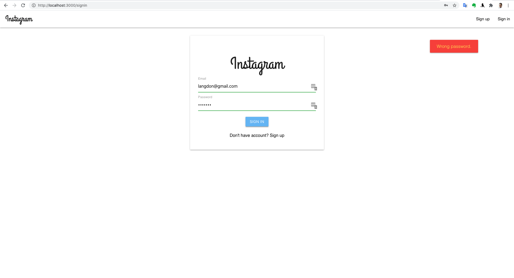
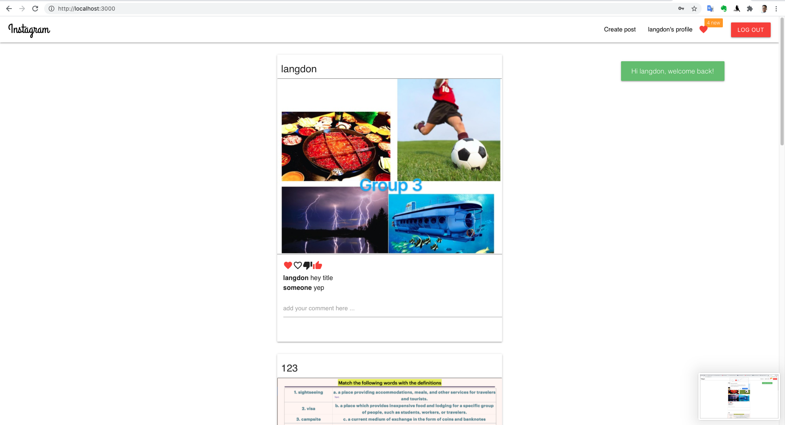
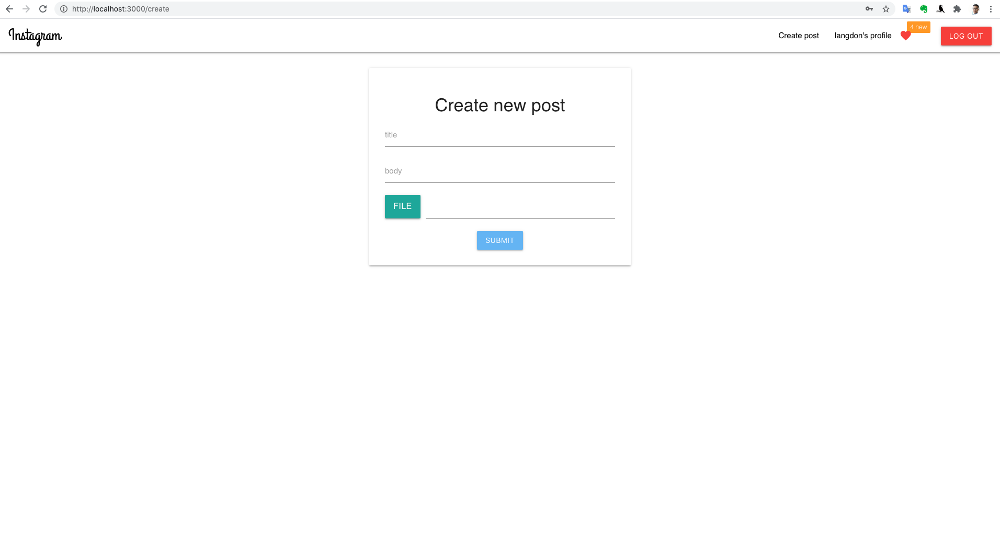
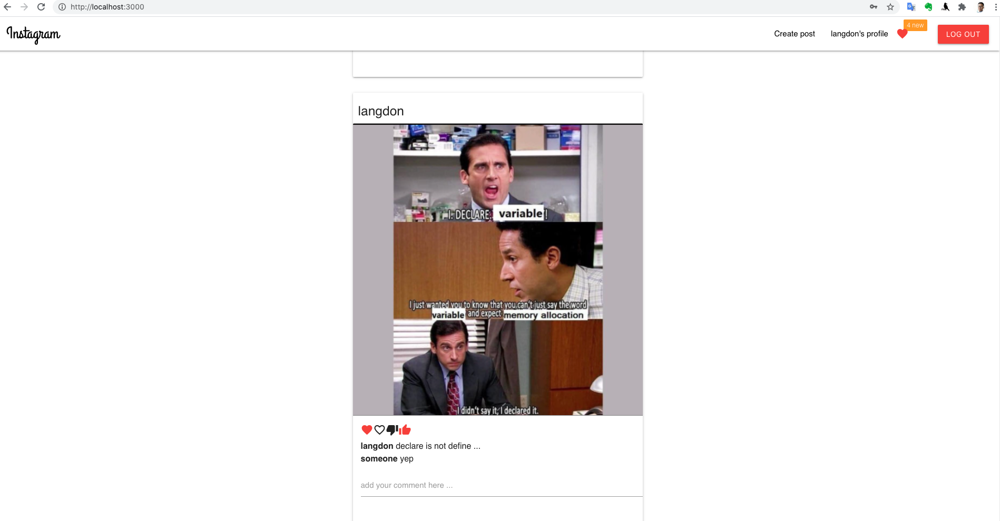

## codersx-reactjs-37

**Clone App**: https://www.instagram.com/

**Back End repo link**
https://github.com/longpos222/codersX-ReactJS-37-be

##### What is done for now?

---

**Back End**
- [x] `mongo` and `mongoose` on Atlas
- [x] User `Shema` models `mongoose.Schema`
- [x] Hash password `bscryptjs`
- [x] Route for Auth, `jsonwebtoken`
- [x] Verify token for `loginRequire` middleware
- [x] Post Schema models `mongoose.Schema`
- [x] Route for `/allpost` `/mypost` `/createpost`

---

**Front End**
- [x] Initial and clean up `create-react-app`
- [x] Routing for ReactJS on Front End
- [x] Setup components:`Signin`, `Signup`, `Profile`, `Home`, `Navbar`,`Post`, `CreatePost`
- [x] Setup upload to Cloudinary & save `token` to `localStorage`
- [x] Setup `useContext` & `useReducer` for User
- [x] Setup Navigate between NavBar, Sign In, Sign Up, Log Out
- [x] Fetch API for all posts and current user info

---

**loading ...**

- [ ] API and implement on front end for `likes` `comments`
- [ ] Follow and unfollow users
- [ ] Forgot and reset password
- [ ] Searchbar for user and post contents

---

**Some screenshots**

